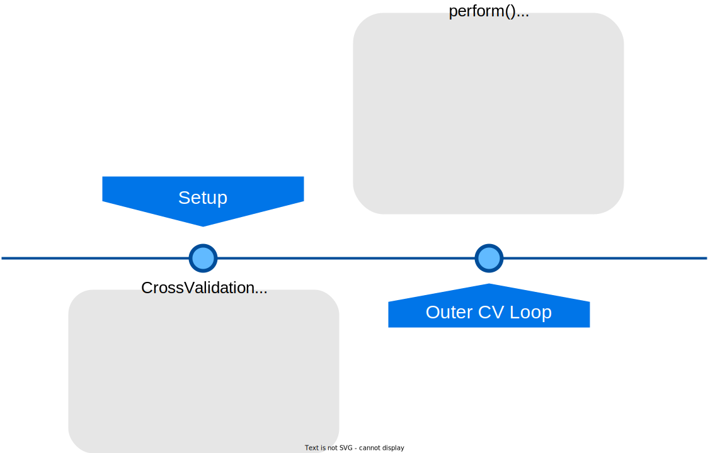
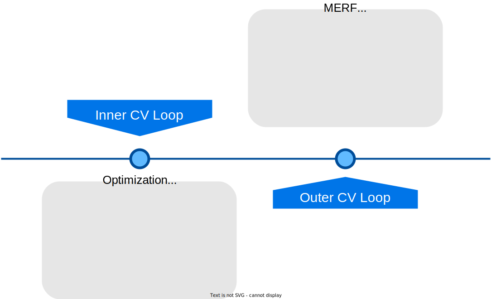
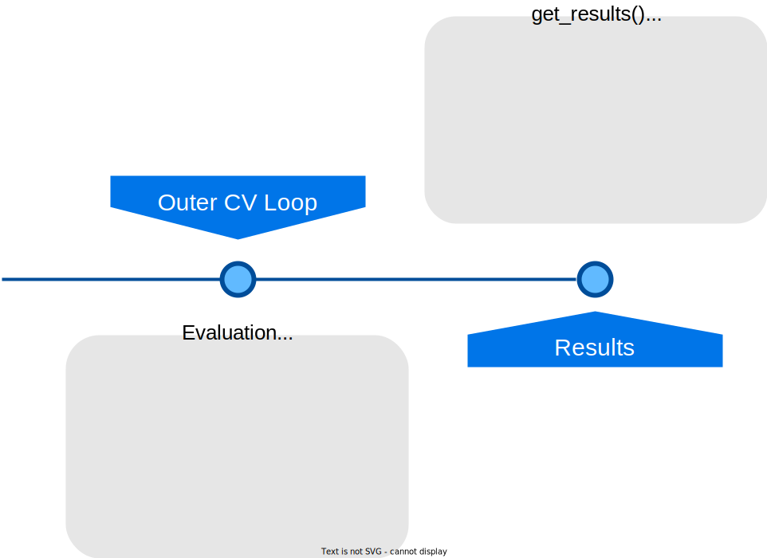

In this guide we will go through the steps of a typical `flexcv` workflow for nested cross validation.

Let's have a look at the following flowchart to get an overview of the steps we will take:

### Why do we need nested cross validation?

The motivation to perform nested cross validation is to get an unbiased estimate of the generalization performance of a model while achieving a fair hyperparameter tuning. If you tune the hyperparameters of your model on the whole data that you have, you overfit the model and lose ability to generalize on unseen data. If you fit your model on the whole dataset you lose data to estimate the generalization performance of your model. This is where nested cross validation comes in. It splits the data into training and testing data and then splits the training data again into training and validation data. The model is fit on the training data and evaluated on the validation data. This is done for every fold of the cross validation. The outer loop iterates over the folds and the inner loop evaluates a single model from the hyperparameter search space.

### Step 1: Set up the `CrossValidation` instance

Let's start with the first step. Here, we define our `CrossValidation` instance. After that we configure it to our needs by adding data, model mappings, choosing split methods and deciding if we need to evaluate mixed effects (i.e. with MERF correction for clustered data). Then we call `perform()` which under the hood calls the `cross_validate`function from the `core` module.

### Step 2: Perform the cross validation

The outer loop iterates over the folds which are split by our split classes into training and testing data.
Inside this loop we also iterate over models, which are keys in the model mapping dictionary. Now, we have to perform inner cross validation for models that require hyperparameter tuning. This is done by the optuna package that uses samples a combination of parameters from the distribution in the search space with a [TPE Sampler](https://optuna.readthedocs.io/en/stable/reference/samplers/generated/optuna.samplers.TPESampler.html). Each sampled distribution is cross validated with the inner split to evaluate the model's performance with the given set of parameters. 
The best model, i.e. the model at the objective value optimum after a given number of trials (`n_trials`), is then returned to the outer fold for evaluation on the outer test data which was unseen to this point. For tracking the optimization process we use the `neptune-optuna` integration which allows extensive plots that give you state-of-the-art insights into the optimization process. You can read more about the integration [here](guides/neptune-integration.md).

Then we check, if you want to predict mixed effects with MERF. If so, we have to perform a correction on the predictions of the model. This is done by the `merf` package where the best model from before is fit inside the MERF class. The corrected predictions are then returned to the outer fold for evaluation and training statistics are logged to neptune.

### Step 3: Evaluate the models

In the evaluation step we predict with the model and call all metrics functions defined by the metrics dict of the `CrossValidation` instance on the predictions and the true values. The metrics are then stored in a dictionary with the metric names as keys and the metric values as values. After that we log the metrics to neptune. When this is all done the outer fold continues with the next iteration and we start all over again.

When every model was evaluated on every fold we can conclude the cross validation and return the results. The results are then stored in the `CrossValidation` instance and can be accessed by the `get_results()` method. The results are also stored in the `results` attribute of the `CrossValidation` instance. The results are stored in a dictionary with the model names as keys and the results as values. The results are also stored in a `Results` class instance which has a `summary` property that returns a pandas dataframe with all evaluation metrics for every model and every fold. This dataframe can be exported to excel or csv using the pandas methods `to_excel()` or `to_csv()`.

## Conclusion

In this guide we learned about the steps of a typical `flexcv` workflow for nested cross validation. We learned about the motivation to perform nested cross validation and why it is important to get an unbiased estimate of the generalization performance of a model while achieving a fair hyperparameter tuning. We learned about the steps of the workflow and how to access the results. We also learned about the `neptune` integration and how to use it to track the optimization process of the inner cross validation. We hope this guide was helpful to you and you can use it to get started with `flexcv` for your own projects.