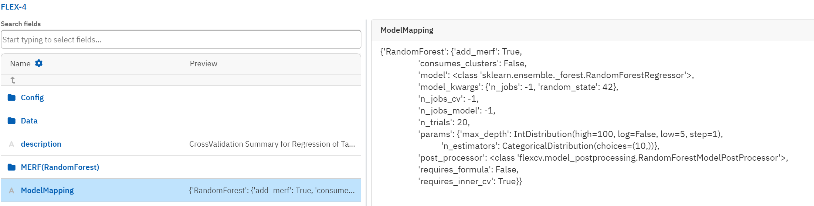
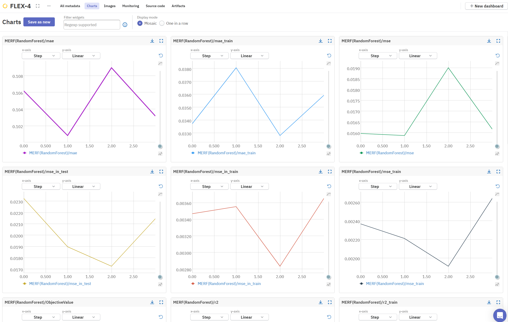
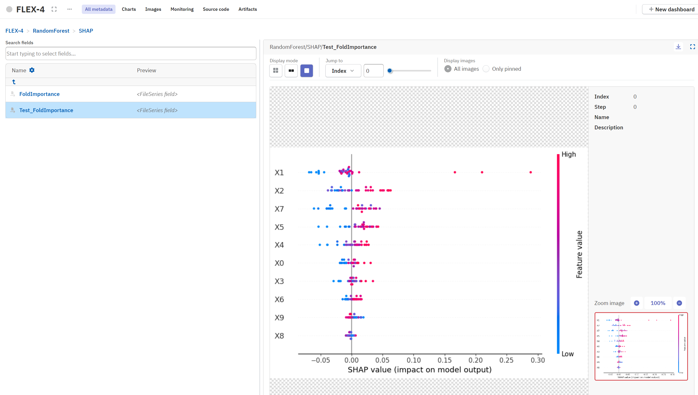
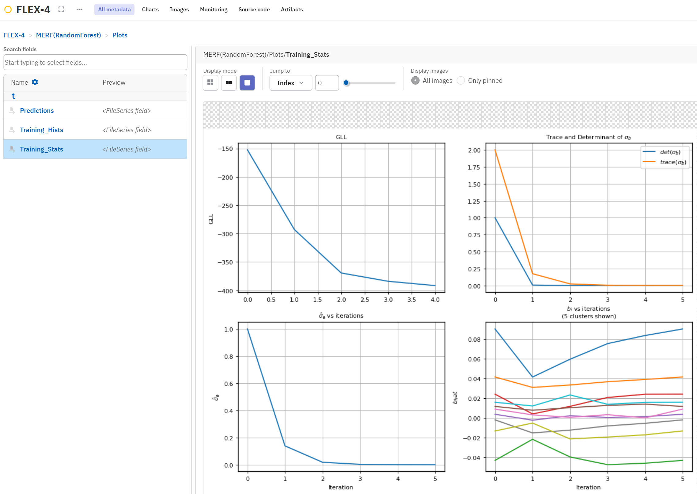
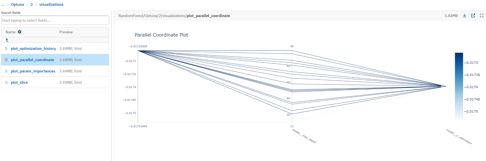

## Neptune Integration

Neptune is a cutting edge MLOps framework that allows you to track your experiments and models in a reproducible way. `flexcv`` deeply integrates neptune in order to track experiments all along the nested cross validation pipelines. You can find more information about Neptune [here](https://neptune.ai/). We highly recommend registering for a free account and trying it out.


### What you get

Let's start with an overview of what we log and how it looks before diving in the specifics how to set up neptune in `flexcv`.
The `set_run` method will automatically create a new experiment in your neptune project and log the following information:

- The whole configuration of the `CrossValidation` instance
    - The configuration of each model
    - The split methods, the number of folds, the number of trials, etc.
    - Scaling methods
    - ...
- The results of each model evaluated with every metric defined in the metrics dict of the `CrossValidation` instance
- Every model instance from the outer folds
- The best parameters of each inner cross validation
- Plots of the hyperparameter tuning
- Plots generated by the post processors (SHAP beeswarm plots etc.)
- Diagnostics plots of the cross validation
- The data used for the cross validation

##### Configuration
In neptune you can easily inspect your configuration and results. Here is an example:


##### Evaluation

Neptune let's you keep track of all of your metrics:


##### Feature Importance

Here is an example of a beeswarm plot generated by the `RandomForestModelPostProcessor` to explore the feature importances of the random forest model:


##### Training Statistics

And here is an example of a plot of the training statistics for the MERF class:



##### Optuna Hyperparameter Tuning

Thanks to the integration of optuna, you can also inspect the hyperparameter tuning process.
The parallel coordinate plot is one possibility to visualize the hyperparameter tuning process and uunderstand the influence of each hyperparameter on the performance of the model.




### Setting up Neptune

The neptune python package is installed as a default requirement of this package.
After registering for a free account, you can create a new project and copy the project name and API token to your clipboard.
See the [Neptune documentation](https://docs.neptune.ai/getting-started/installation) for more information on how to set an environment variable for your API token.
This is the recommended way of setting the API token, since it will be automatically loaded by the neptune package and will not be visible in your code.

### Neptune in `flexcv`

To track your experiment in neptune, you create an neptune `run`object and pass it to the `set_run` method of the `CrossValidation` class.

```python
import neptune
from flexcv import CrossValidation
from flexcv.synthesizer import generate_regression


X, y, _, _ =generate_regression(
    3, 25, n_slopes=1, noise_level=9.1e-2
)

yaml_config = """
RandomForest:
  model: sklearn.ensemble.RandomForestRegressor
  post_processor: flexcv.model_postprocessing.RandomForestModelPostProcessor
  requires_inner_cv: false
"""

# create neptune run object and pass your project name
run = neptune.init_run(project="radlfabs/flexcv-testing")

# set up the CrossValidation instance
cv = CrossValidation()
results = (
    cv.set_data(X, y)
    # pass the run object to the CrossValidation instance and set flag for additional plots
    .set_run(run, diagnostics=True)
    .set_splits(n_splits_out=3)
    #... do some configuration
    .set_models(yaml_string=yaml_config)
    .perform()
    .get_results()
)

# it's good practice to stop the run after you are done
run.stop()
```
